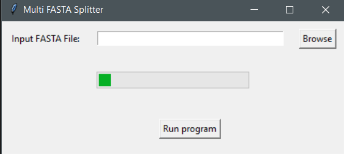
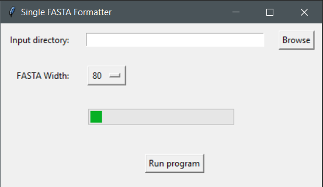

# Multi-FASTA-Splitter

A lightweight fast windows gui app that splits a multi fasta file to individual single fasta files  

## Citations

1. Release v475 Genome Browser Software · ucscGenomeBrowser/kent. Retrieved 7 February 2025, from [https://github.com/ucscGenomeBrowser/kent/releases/tag/v475_branch.1](https://github.com/ucscGenomeBrowser/kent/releases/tag/v475_branch.1)
2. Tsiouri Olga. Multi FASTA Splitter: A lightweight fast windows gui app that splits a multi fasta file to individual single fasta files.[https://github.com/BioGUIwsl1Lab/Multi-FASTA-Splitter](https://github.com/BioGUIwsl1Lab/Multi-FASTA-Splitter)

## Dependencies

1. Windows 10 version 2004 and higher (Build 19041 and higher) or Windows 11(type `winver` on the search button and click `winver` to find your OS version)
2. [Windows Subsystem for linux(wsl2)](INSTALL.md)
3. the file `Multi FASTA Splitter.exe` in the `bin` folder

## Usage 

1. Click on the `Multi FASTA Splitter.exe` file

2. Click `browse` and select an input file

3. Click `Run program`

As seen in the folder the program creates an output folder to store the single-FASTA files

if you want to reformat the output fasta files download and open `Single FASTA Formatter.exe` from the `bin` folder:

1. Click `browse` and select the directory where the output .fa files are located.
2. Select the FASTA Width
3. Click `Run program`

The example input/output files can be seen on the `data` folder

Input date were retrieved from solgenomics.net tomato annotation version 4.1.
